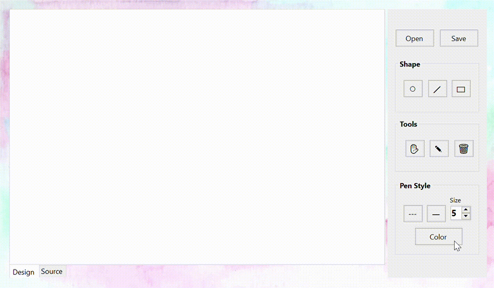

# Drawing Engine Project
Simple drawing engine made by C# using GDI+ library

## Demo

## Made by
- Reema Alyousef
- Raneen Alzafarani
- Batool Alghamdi
- Maryam Alraddadi

## Features 
- Draw, resize, and drag shapes.
- Change pen settings.
- Change shapes' style.
- Draw by mouse, and by source code.
- Save drawing canvas as source code with the extension (.drw), and open .drw files and render them in the canves.
- Clear the canvas.
